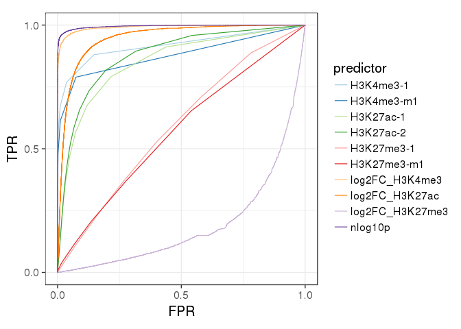
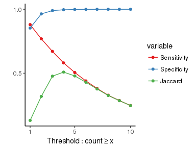

# Sensitivity and Specificity of ChILT

*prediction of ENCODE C2C12 H3K4me3 peaks (ENCSR000AHO) from ChILT-H3K4me3(#3)*

### Setup


```r
library(dplyr)
library(data.table)
library(dtplyr)
library(ggplot2)
source("RScripts/geomNorm.R")
source("RScripts/myROC.R")

# X: data_frame, bs: bin size
binning <- function(X,bs)
  X %>% as_tibble %>% 
    mutate(bin=floor(start/bs)) %>% group_by(chr,bin) %>%
    mutate(start=as.integer(min(start)),end=as.integer(max(end))) %>%
    group_by(chr,start,end) %>% dplyr::select(-bin) %>%
    summarise_all(sum) %>% ungroup

# Poisson p with pseudo-count: P(X>=x)
ppwp <- function(x,a=0) ppois(x+a-1,mean(x+a),lower.tail=FALSE,log.p=TRUE)

tableCP <- function(x,a=0) 
  data_frame(count=x) %>%
  mutate(
    nlog10p.pois = -ppwp(count,a)/log(10)
  ) %>% mutate(
    p.pois.adj = p.adjust(10^-nlog10p.pois,method="BH")
  ) %>% arrange(count) %>% distinct

tablemd <- function(x,...) knitr::kable(x,format="markdown",...)
```


```r
print(sessionInfo(),locale=FALSE)
```

```
## R version 3.3.2 (2016-10-31)
## Platform: x86_64-pc-linux-gnu (64-bit)
## 
## attached base packages:
## [1] stats     graphics  grDevices utils     datasets  methods   base     
## 
## other attached packages:
## [1] ggplot2_2.2.1     dtplyr_0.0.2      data.table_1.10.4 dplyr_0.7.3      
## 
## loaded via a namespace (and not attached):
##  [1] Rcpp_0.12.12     knitr_1.17       bindr_0.1        magrittr_1.5    
##  [5] munsell_0.4.3    colorspace_1.3-2 R6_2.2.2         rlang_0.1.2     
##  [9] plyr_1.8.4       stringr_1.2.0    tools_3.3.2      grid_3.3.2      
## [13] gtable_0.2.0     htmltools_0.3.6  lazyeval_0.2.0   yaml_2.1.14     
## [17] assertthat_0.2.0 rprojroot_1.2    digest_0.6.12    tibble_1.3.4    
## [21] bindrcpp_0.2     glue_1.1.1       evaluate_0.10.1  rmarkdown_1.6   
## [25] stringi_1.1.5    scales_0.5.0     backports_1.1.0  pkgconfig_2.0.1
```

### Load data


```r
X <- fread(
  "zcat < data/counts1k_goldset.txt.gz",
  colClasses = c("character",rep("integer",20))
)
```

```
## 
Read 44.3% of 2730631 rows
Read 80.2% of 2730631 rows
Read 2730631 rows and 21 (of 21) columns from 0.238 GB file in 00:00:04
```

```r
colnames(X) <- sub("\\.bam$","",gsub("['#]","",colnames(X)))
colnames(X)[4:9] <- c("eH3K27me3","eH3K27me3Input","rH3K27ac","rH3K27acInput","eH3K4me3","eH3K4me3Input")
X <- X %>% filter(chr %in% 1:19)
```


```r
peak <- fread(
  "zcat < data/eOverlapCount_eH3K4me3.txt.gz",
  colClasses = c("character",rep("integer",3))
)
colnames(peak) <- c("chr","start","end","npeak")
peak <- peak %>% filter(chr %in% 1:19)
X <- bind_cols(X,npeak=peak$npeak)
```

### Binning and calculate stats


```r
bs <- 4000
target <- "H3K4me3-1"
Xb <- X %>% binning(bs)
Xg <- gscale(dplyr::select(Xb,4:9)+1)
Xb <- bind_cols(Xb,
    log2FC_H3K4me3 = log2(Xg[,"eH3K4me3"]+1)-log2(Xg[,"eH3K4me3Input"]+1),
    log2FC_H3K27ac = log2(Xg[,"rH3K27ac"]+1)-log2(Xg[,"rH3K27acInput"]+1),
    log2FC_H3K27me3 = log2(Xg[,"eH3K27me3"]+1)-log2(Xg[,"eH3K27me3Input"]+1),
    nlog10p = -ppois(Xg[,"eH3K4me3"],Xg[,"eH3K4me3Input"]+1,lower.tail=FALSE,log.p=TRUE)/log(10)
)
```

### Showing overall performance


```r
Xs <- dplyr::select(Xb,
  `H3K4me3-1`, `H3K4me3-m1`,
  `H3K27ac-1`, `H3K27ac-2`,
  `H3K27me3-1`,`H3K27me3-m1`,
  starts_with("log2FC"), nlog10p
)

plotROCs(Xs, Xb$npeak > 0, pts=FALSE) +
  coord_fixed() + scale_color_brewer(palette="Paired")
```

<!-- -->

### Optimal balance of sensitivity and specificity


```r
roc <- tableTPFP(pull(Xb,target),Xb$npeak>0) 

roc.long <- roc %>% 
  filter(threshold > 0 & threshold <= 10) %>%
  mutate(Sensitivity=TPR, Specificity=1-FPR) %>% 
  melt(
    id = "threshold",
    measure = c("Sensitivity", "Specificity", "Jaccard")
  )

ggplot(roc.long,aes(threshold,value,colour=variable)) +
  geom_line() + geom_point() + theme_classic() +
  scale_x_continuous(breaks = c(1,5,10)) +
  scale_y_continuous(breaks = seq(0,1,0.5)) +
  scale_color_brewer(palette="Set1") +
  xlab(expression(Threshold: count >= x)) + ylab("")
```

<!-- -->


```r
# Corresponding Poisson P-values
pull(Xb,target) %>% tableCP %>% head(10) %>% round(3) %>% tablemd
```


| count| nlog10p.pois| p.pois.adj|
|-----:|------------:|----------:|
|     0|        0.000|      1.000|
|     1|        0.515|      1.000|
|     2|        1.281|      0.961|
|     3|        2.209|      0.230|
|     4|        3.257|      0.031|
|     5|        4.399|      0.003|
|     6|        5.619|      0.000|
|     7|        6.905|      0.000|
|     8|        8.248|      0.000|
|     9|        9.642|      0.000|

```r
# TPR, FPR and other similarity measures
roc %>% arrange(threshold) %>% head(10) %>% round(3) %>% tablemd
```


| threshold|     FP|    TP|    FN|     TN|   TPR|   FPR|    YJ| Jaccard|
|---------:|------:|-----:|-----:|------:|-----:|-----:|-----:|-------:|
|         0| 600296| 15392|     0|      0| 1.000| 1.000| 0.000|   0.025|
|         1|  88088| 13548|  1844| 512208| 0.880| 0.147| 0.733|   0.131|
|         2|  21750| 11836|  3556| 578546| 0.769| 0.036| 0.733|   0.319|
|         3|   6248| 10322|  5070| 594048| 0.671| 0.010| 0.660|   0.477|
|         4|   2181|  8939|  6453| 598115| 0.581| 0.004| 0.577|   0.509|
|         5|    862|  7784|  7608| 599434| 0.506| 0.001| 0.504|   0.479|
|         6|    363|  6767|  8625| 599933| 0.440| 0.001| 0.439|   0.430|
|         7|    172|  5866|  9526| 600124| 0.381| 0.000| 0.381|   0.377|
|         8|     85|  5049| 10343| 600211| 0.328| 0.000| 0.328|   0.326|
|         9|     49|  4408| 10984| 600247| 0.286| 0.000| 0.286|   0.285|


### Investigate neighbors of TPs


```r
optThresh <- with(roc,threshold[which.max(Jaccard)])
v <- labelTPFP(pull(Xb,target)>=optThresh,Xb$npeak > 0)
table(left=v[-length(v)],right=v[-1]) %>% addmargins %>% tablemd
```


|    |     TN|   FN|   FP|   TP|    Sum|
|:---|------:|----:|----:|----:|------:|
|TN  | 586512| 4420| 1617| 5565| 598114|
|FN  |   4434| 1033|   62|  924|   6453|
|FP  |   1629|   60|   86|  406|   2181|
|TP  |   5539|  940|  416| 2044|   8939|
|Sum | 598114| 6453| 2181| 8939| 615687|

```r
# for triplets
table(
  left   = v[-c(length(v)-1,length(v))],
  center = v[-c(1,length(v))],
  right  = v[-c(1,2)]
) %>% ftable
```

```
##             right     TN     FN     FP     TP
## left center                                  
## TN   TN           575740   4200   1414   5157
##      FN             2651    943     25    801
##      FP             1182     46     55    334
##      TP             2966    780    227   1592
## FN   TN             4211     92     36     95
##      FN              934     47      6     46
##      FP               50      2      3      7
##      TP              760     40     34     90
## FP   TN             1448     24     43    114
##      FN               27      9      1     23
##      FP               46      2      6     32
##      TP              219     34     27    126
## TP   TN             5112    104    124    199
##      FN              822     34     30     54
##      FP              351     10     22     33
##      TP             1594     86    128    236
```

### Output ChILT-peaks with labels (TP,FP,FN) in BED format


```r
bpal <- c("0,0,0","255,255,0","255,0,0","0,0,255")

A <- Xb %>% transmute(
    chr, start, end, name=labelTPFP(`H3K4me3-1`>=optThresh,npeak>0),
    score=`H3K4me3-1`, strand="."
  ) %>% filter(name!="TN") %>% 
  mutate(tstart=start, tend=end, itemRGB=bpal[name])

write.table(A, file="chiltpeaks.bed",
  quote=FALSE, sep="\t", row.names=FALSE, col.names = FALSE)
```


